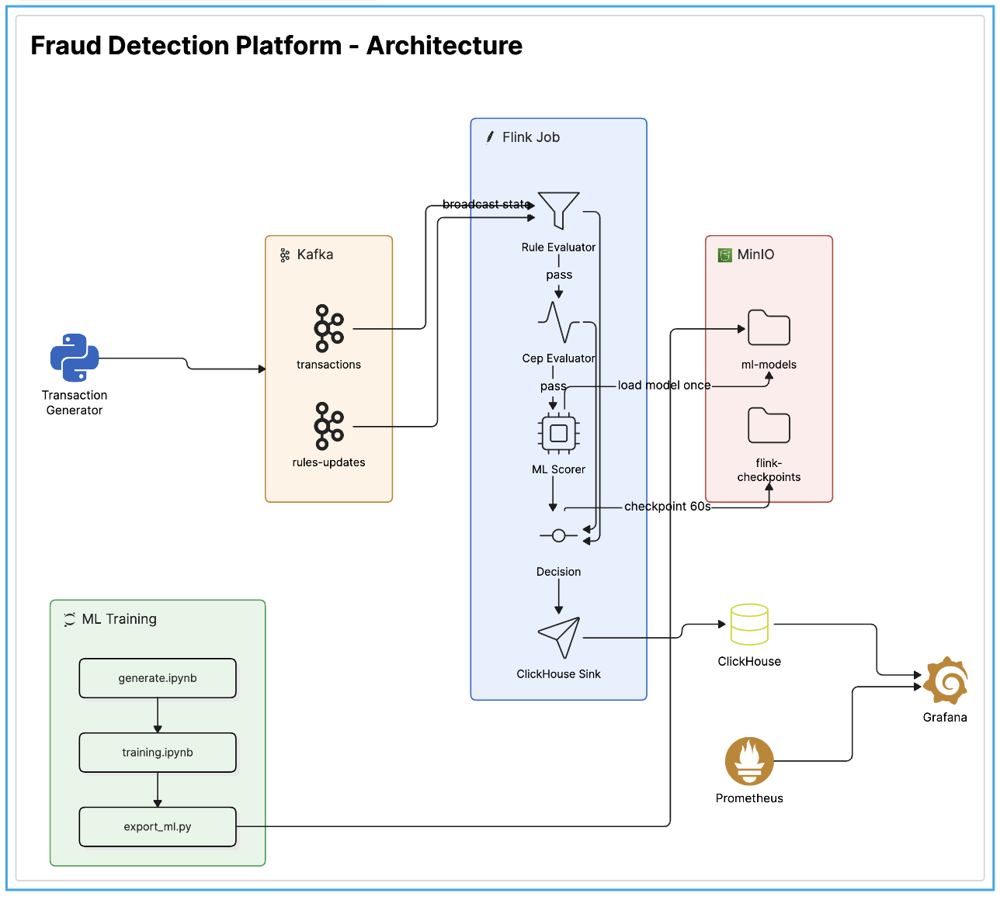

# Fraud Detection Platform

A real-time fraud detection platform for banking transactions, built as a learning project in
stream processing with Apache Flink. Transactions are ingested through Kafka, evaluated by three
independent detection engines (Rules, CEP, ML scoring), and decided as `APPROVED` / `ALERT` /
`BLOCK` within sub-second latency. The full functional and performance requirements are defined
in [`TASK.md`](TASK.md).



## Documentation

- [`docs/architecture/system-overview.md`](docs/architecture/system-overview.md) — components,
  topology, key design decisions
- [`docs/architecture/component-design.md`](docs/architecture/component-design.md) — per-engine
  design (Rules, CEP, ML, Decision Engine)
- [`docs/architecture/data-flow.md`](docs/architecture/data-flow.md) — end-to-end transaction and
  rule-update trace

## Tech Stack

| Layer | Technology |
|---|---|
| Ingestion | Apache Kafka (3-broker cluster) |
| Stream Processing | Apache Flink 1.20 (Java 17) |
| Analytics Store | ClickHouse |
| Model Storage | MinIO |
| Monitoring | Prometheus + Grafana |
| Traffic Generation / Evaluation | Python |
| ML Training | XGBoost (offline, via Jupyter notebooks) |

## Repository Layout

```
flink-jobs/               Java/Maven multi-module Flink job
  common/                 shared models, (de)serializers
  rule-engine/             Rules Engine (Broadcast State Pattern)
  cep-engine/              CEP Engine (4 sequence-based fraud patterns)
  ml-scoring/              feature extraction + XGBoost scoring
  decision-aggregator/     job entry point, decision pipeline, sinks

services/
  transaction-generator/   synthetic transaction + rule-update producer
  ml-training/             offline XGBoost training pipeline (notebooks)

benchmarks/                stress test (throughput ramp + latency/backpressure report)
infra/                     docker-compose stack, ClickHouse/Grafana/Prometheus/Kafka config
scripts/                   host-level automation (start/stop/reset/benchmark)
schemas/                   JSON Schemas for the Kafka message formats
docs/                      architecture docs, runbooks, diagrams
```

## Quickstart

```bash
pip install -r requirements.txt

make up                      # docker compose up + build + submit the Flink job
make benchmark                # optional: run the stress test (see benchmarks/)
make down                     # truncate ClickHouse + docker compose down
make reset                     # wipe ClickHouse/Kafka/checkpoints and resubmit fresh
```

Run `make` with no arguments to list all available targets. See
[`services/transaction-generator/README.md`](services/transaction-generator/README.md) for
seeding the account pool and generating labelled transaction traffic, and
[`services/ml-training/README.md`](services/ml-training/README.md) for retraining and publishing
the fraud-scoring model.

## Testing

```bash
cd flink-jobs && mvn test
```

`RuleEngineTest` (rule-update latency) requires a live Kafka + Flink + ClickHouse stack and is
skipped unless `RUN_LIVE_INTEGRATION_TESTS=true` is set.
